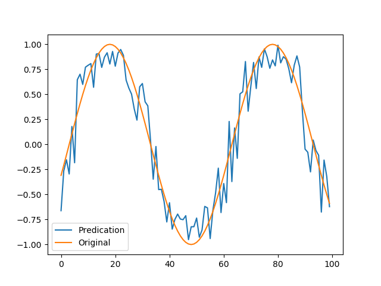
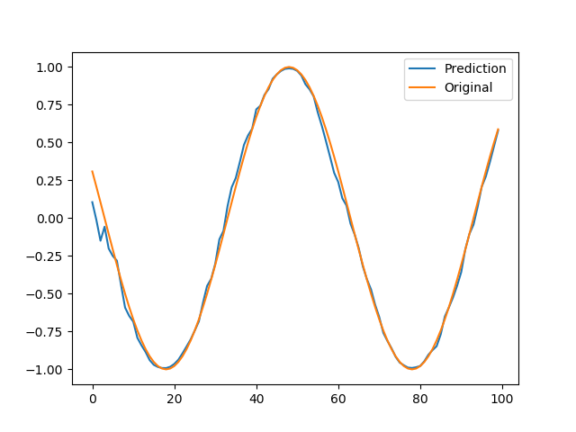
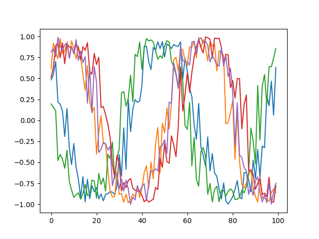
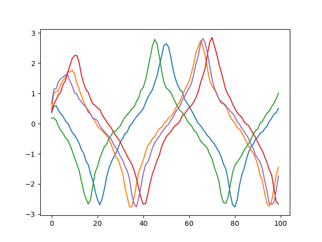

## The Impact of Changes in Network Connectivity

### Implement a Small Feed-Forward Network
To run: `python simpleFeedForward.py`    
    
<br>
**Training Set** Loss Values:    
```
Epoch: 0        Loss Value: 0.6951357126235962
Epoch: 20       Loss Value: 0.16586269438266754
Epoch: 40       Loss Value: 0.15920604765415192
Epoch: 60       Loss Value: 0.15309925377368927
Epoch: 80       Loss Value: 0.15108461678028107
Epoch: 100      Loss Value: 0.14940877258777618
Epoch: 120      Loss Value: 0.1477908343076706
Epoch: 140      Loss Value: 0.14633885025978088
Epoch: 160      Loss Value: 0.145173579454422
Epoch: 180      Loss Value: 0.14435650408267975
Epoch: 200      Loss Value: 0.14388370513916016
Epoch: 220      Loss Value: 0.14366371929645538
Epoch: 240      Loss Value: 0.14357410371303558
Epoch: 260      Loss Value: 0.14354102313518524
Epoch: 280      Loss Value: 0.1435251235961914
Epoch: 300      Loss Value: 0.14351074397563934
```
**Testing Set** Loss Values:    
```
Loss on Test Set: 0.1436815857887268
```


### Implement a Small Recurrent Network
To run: `python simpleRNN.py`    
    
<br>
Training Set Loss Values:    
```
Epoch: 0        Loss Value: 0.6104775071144104
Epoch: 20       Loss Value: 0.12301364541053772
Epoch: 40       Loss Value: 0.10840867459774017
Epoch: 60       Loss Value: 0.09246223419904709
Epoch: 80       Loss Value: 0.08078140765428543
Epoch: 100      Loss Value: 0.0882892906665802
Epoch: 120      Loss Value: 0.060669515281915665
Epoch: 140      Loss Value: 0.07317197322845459
Epoch: 160      Loss Value: 0.055374857038259506
Epoch: 180      Loss Value: 0.062226708978414536
Epoch: 200      Loss Value: 0.052031420171260834
Epoch: 220      Loss Value: 0.048966631293296814
Epoch: 240      Loss Value: 0.060129664838314056
Epoch: 260      Loss Value: 0.047237660735845566
Epoch: 280      Loss Value: 0.048343267291784286
Epoch: 300      Loss Value: 0.04468081519007683
```
Testing Set Loss Values:    
```
0.0471196249127388
```   

*As we can see, RNN has a better performance.*    
<br>


### Record the Activations from the Two Networks
Feed Forward: `0.08135928958654404`     
Recurrent: `0.16319264471530914`

### Compare the Activations from the Two Networks
<br>

**Feed Forward:**     
    
<br>  

**RNN:**      
    
<br>  